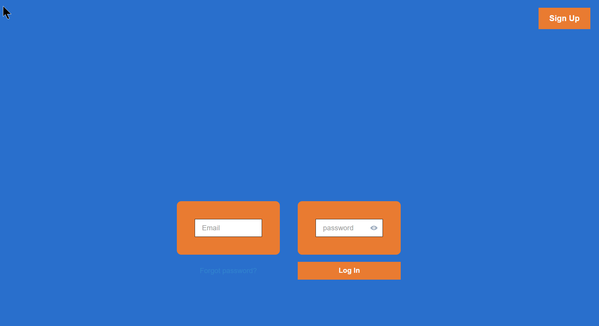
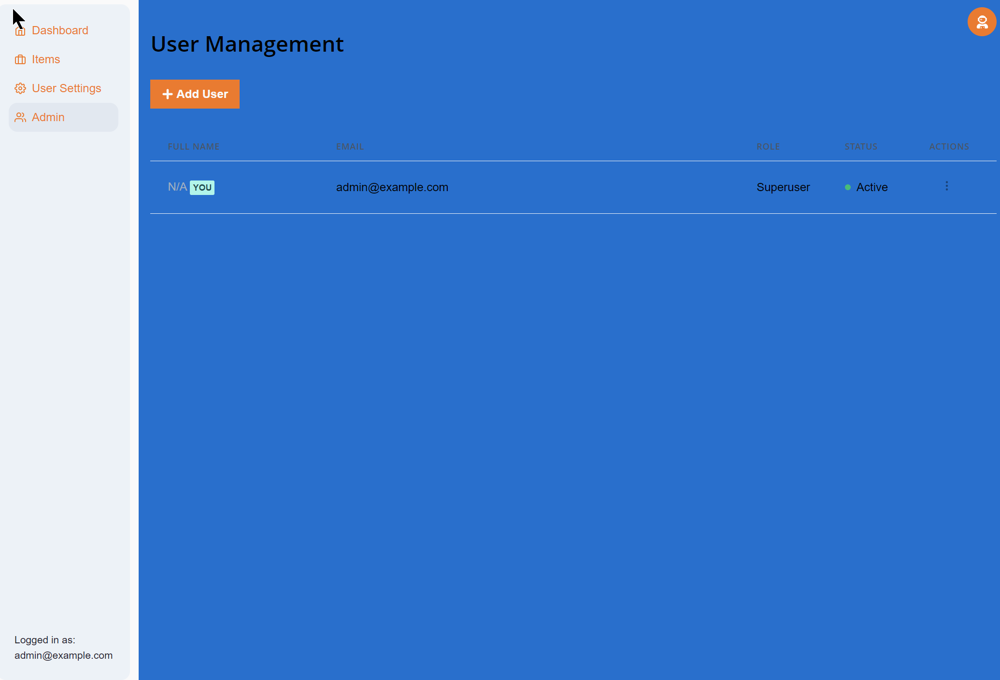
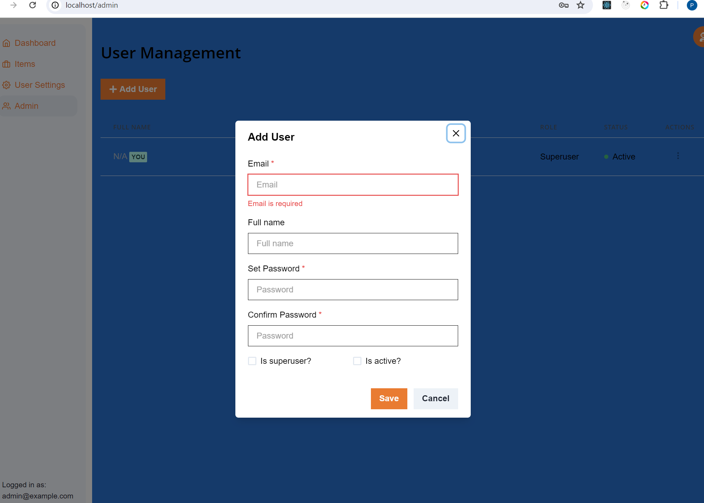
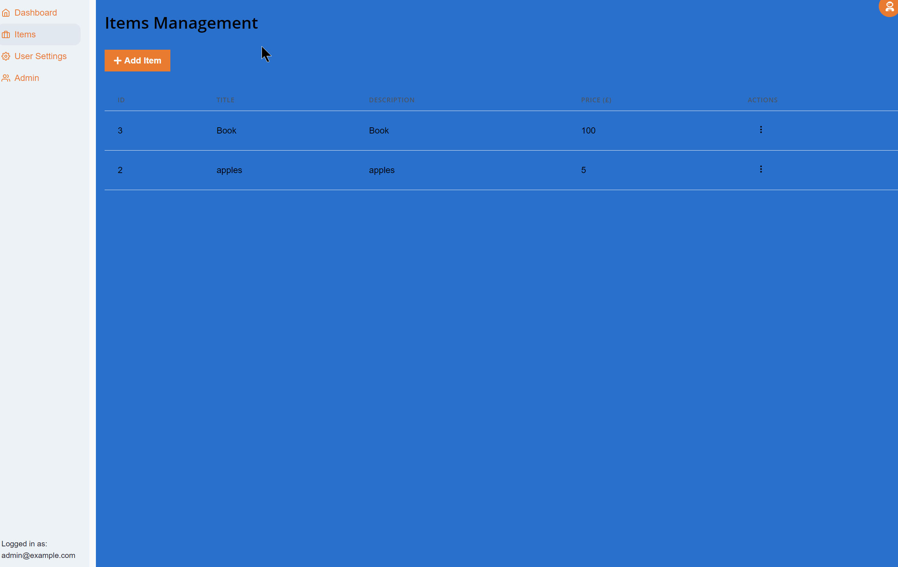

# Full Stack Store

## Context

This attempts to provide a basic design for the screens depicted in the design requirements / wireframe document:

## Project Stucture

```
project
│   README.md
│   docker-compoese.yml (used to build whole app as services)    
│
└───backend
│   │   alembic (database migrations)
│   │
│   └───app
│       │   main.py (main fastApi app entry)
│       │   models.py (pydantic models for db)
│       └───api
|           | deps.py
|           | main.py 
│           └───routes            
└───frontend
|   │   package.json
│   └───src
|       | main.tsx ( entry point for react app using chakra)
│       └───client (autogenerated client including services based on openAPI)|
|       |   | ...
│       └───components (react UI components)
|       |   | ...
│       └───hooks (react hoooks)
|           | ...
|        | ...
|
└───infra (terraform files to deploy to cloud)
|    │   main.tf
|    │   variables.tf
|    |   ...
│
└───img (images used in docs)
```

## Shortcuts

These are there shortcuts used for this project:

 - [**FastAPI full stack template**](https://fastapi.tiangolo.com/project-generation/) to get the main structure of what the project needs

    - Backend Web framework: FastApi - Python framework
    - Front End: React - Generated using openApi
    - Security
    - Database (using Postgres)
    - ORM - SqlModel built on SqlAlchemy using Alembic for migrations
    - Endpoints to manage users and add items

- Given above plan is to do following
    
    - Change the Theme of the react UI by overriding the theme - see frontend\src\theme.tsx


- Chat GPT / LLMs: To get up to speed with some of the Tech used in the full stack template

## Assumptions

What assumptions were made when addressing this task:

- It is not that important to style out the sub pages - this can be done later
- It is desirable to have the whole process repeatable. Therefore the infra is setup using terraform.
- Buttons that maybe present on the design do not need fully functioning pages behind them at this stage. Having said that this is just a plumbing issue as the template used includes user registration.

## Next Steps ( still to do !!)

- Styling doesn't quite reflect the design doc; font, italics etc
- Deploying to the cloud: make sure the terraform works

## Technology Stack and Features

- ⚡ [**FastAPI**](https://fastapi.tiangolo.com) for the Python backend API.
    - 🧰 [SQLModel](https://sqlmodel.tiangolo.com) for the Python SQL database interactions (ORM).
    - 🔍 [Pydantic](https://docs.pydantic.dev), used by FastAPI, for the data validation and settings management.
    - 💾 [PostgreSQL](https://www.postgresql.org) as the SQL database.
- 🚀 [React](https://react.dev) for the frontend.
    - 💃 Using TypeScript, hooks, Vite, and other parts of a modern frontend stack.
    - 🎨 [Chakra UI](https://chakra-ui.com) for the frontend components.
    - 🤖 An automatically generated frontend client.
    - 🦇 Dark mode support.
- 🐋 [Docker Compose](https://www.docker.com) for development and production.
- 🔒 Secure password hashing by default.
- 🔑 JWT token authentication.
- 📫 Email based password recovery.
- ✅ Tests with [Pytest](https://pytest.org).
- 📞 [Traefik](https://traefik.io) as a reverse proxy / load balancer.
- 🚢 Deployment instructions using Docker Compose, including how to set up a frontend Traefik proxy to handle automatic HTTPS certificates.
- 🏭 CI (continuous integration) and CD (continuous deployment) based on GitHub Actions.

### Dashboard Login

[](https://github.com/tiangolo/full-stack-fastapi-template)

### Dashboard - Admin

[]()

### Dashboard - Create User

[]()

### Dashboard - Items

[]()


### Interactive API Documentation

[](https://github.com/tiangolo/full-stack-fastapi-template)

## How To Use It

You can **clone** this repository and use it as is.

✨ It just works. ✨


```bash
git clone https://github.com/patrickjlanders/full-stack-store.git
```

- Enter into the new directory:

```bash
cd full-stack-store
```

- Run docker compose to start services

```bash
docker compose up -d
```

- Go to develop details below to see thr urls

### Update From the Original Template

After cloning the repository, and after doing changes, you might want to get the latest changes from this original template.

- Make sure you added the original repository as a remote, you can check it with:

```bash
git remote -v

origin    git@github.com:octocat/my-full-stack.git (fetch)
origin    git@github.com:octocat/my-full-stack.git (push)
upstream    git@github.com:tiangolo/full-stack-fastapi-template.git (fetch)
upstream    git@github.com:tiangolo/full-stack-fastapi-template.git (push)
```

- Pull the latest changes without merging:

```bash
git pull --no-commit upstream master
```

This will download the latest changes from this template without committing them, that way you can check everything is right before committing.

- If there are conflicts, solve them in your editor.

- Once you are done, commit the changes:

```bash
git merge --continue
```

### Configure

You can then update configs in the `.env` files to customize your configurations.

Before deploying it, make sure you change at least the values for:

- `SECRET_KEY`
- `FIRST_SUPERUSER_PASSWORD`
- `POSTGRES_PASSWORD`

You can (and should) pass these as environment variables from secrets.

Read the [deployment.md](./deployment.md) docs for more details.

### Generate Secret Keys

Some environment variables in the `.env` file have a default value of `changethis`.

You have to change them with a secret key, to generate secret keys you can run the following command:

```bash
python -c "import secrets; print(secrets.token_urlsafe(32))"
```

Copy the content and use that as password / secret key. And run that again to generate another secure key.

## Backend Development

Backend docs: [backend/README.md](./backend/README.md).

## Frontend Development

Frontend docs: [frontend/README.md](./frontend/README.md).

## Deployment

Deployment docs: [deployment.md](./deployment.md).

## Development

General development docs: [development.md](./development.md).

This includes using Docker Compose, custom local domains, `.env` configurations, etc.

## Release Notes

Check the file [release-notes.md](./release-notes.md).

## License

The Full Stack FastAPI Template is licensed under the terms of the MIT license.
